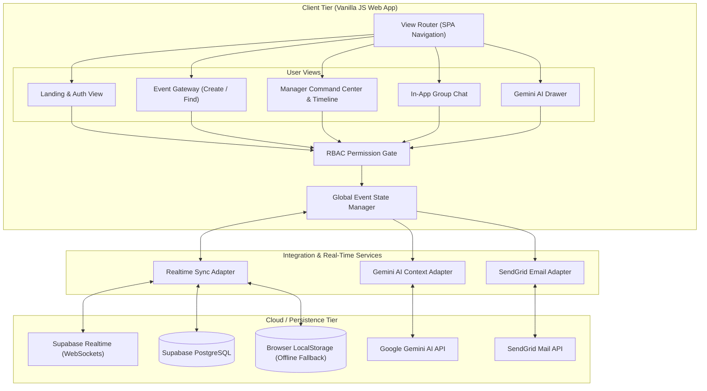
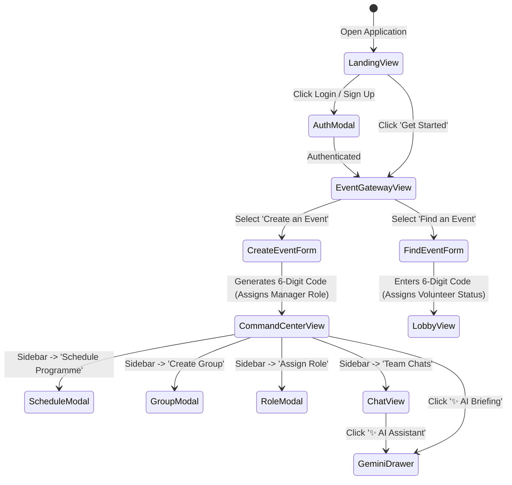
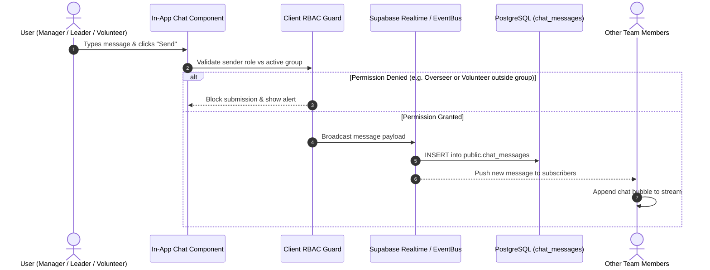

# System Architecture Document (ARCHITECTURE.md)
## Project Name: Sangam (സംഗമം) — Event Command & Coordination Platform
**Team:** LINX (Kraft Night 2026 Hackathon)  
**Status:** Approved for Implementation  
**Author:** Team LINX  

---

## 1. High-Level Architecture Overview

Sangam is architected as an **Event-Driven, Real-Time Web Application** with clear separation of concerns across presentation, state orchestration, data persistence, and AI intelligence.



---

## 2. Information Architecture & View Lifecycle

The user flows through two entry views plus five workspace pages, dynamically managed by the client-side View Router without full page reloads (legacy `chat` view normalizes to `groups`):



---

## 3. Data Flow Workflows

### 3.1. Event Creation & Manager Assignment
1. User enters the Event Title (e.g., *"Kraft Night 2026"*).
2. The client invokes `generateEventCode()`, creating a cryptographically random 6-digit alphanumeric PIN (e.g., `482910`).
3. The event record is committed to PostgreSQL (`public.events`).
4. An `event_members` record is created linking the user ID to the new `event_id` with `role = 'manager'`.
5. The UI updates the header with the Event Code badge and loads the Manager Command Center.

### 3.2. Joining via 6-Digit Code & Member Roster
1. A participant visits the application and selects **Find an Event**.
2. They enter `482910`. The system queries `public.events WHERE six_digit_code = '482910'`.
3. If valid, an `event_members` record is inserted with `role = 'volunteer'` and `department_id = NULL` (unassigned).
4. The Manager's **Joined People** roster updates via Realtime WebSocket:
   - Attendee appears with status tag: `Awaiting Assignment`.
5. The Manager opens the **Assign Role & Group** dropdown:
   - Selects Role: `VIP / Overseer`, `Team Leader`, or `Volunteer`.
   - Selects Operational Group: `Food Coordination`, `Stage & Sound`, etc.
6. The updated role and group propagate instantly to the member's session.

### 3.3. In-App Group Chat Message Broadcasting


---

## 4. State Management Architecture

The application implements a centralized reactive state store (`AppState`) encapsulated in `config.js` and `main.js`:

```javascript
const AppState = {
  currentUser: {
    id: "user-001",
    name: "Aravind Menon",
    email: "aravind@example.com",
    role: "manager", // 'manager' | 'overseer' | 'lead' | 'volunteer'
    avatar: "https://api.dicebear.com/7.x/bottts/svg?seed=Aravind",
    assignedGroupId: null
  },
  currentEvent: {
    id: "evt-001",
    title: "Kraft Night 2026",
    sixDigitCode: "482910",
    status: "active"
  },
  programmes: [],      // Array of scheduled timeline items
  groups: [],          // Operational committees (Food, Stage, etc.)
  members: [],         // Joined people roster
  chatMessages: {},    // Map of groupId -> Array of message objects
  activeGroupId: null, // Currently selected chat channel
  activeView: "dashboard" // 'landing' | 'gateway' | 'dashboard' | 'assign-roles' | 'create-program' | 'groups' | 'about-event' (legacy 'chat' -> 'groups')
};
```

---

## 5. Security & Privacy Architecture

1. **Client Role Guarding**:
   - Navigation links, input bars, and action buttons are conditionally disabled or rendered according to `AppState.currentUser.role`.
2. **Database Security (RLS)**:
   - `events`: Publicly queryable by valid 6-digit code. Modifiable only by `manager_id`.
   - `programmes`: Modifiable exclusively by members with `role = 'manager'`.
   - `chat_messages`: Insertable by members who belong to the group (or managers). Overseers and outsiders are restricted to `SELECT` (read-only).
3. **API Key Isolation**:
   - Production secrets for Gemini and SendGrid are stored in environment files or forwarded via Supabase Edge Functions to avoid client exposure.
