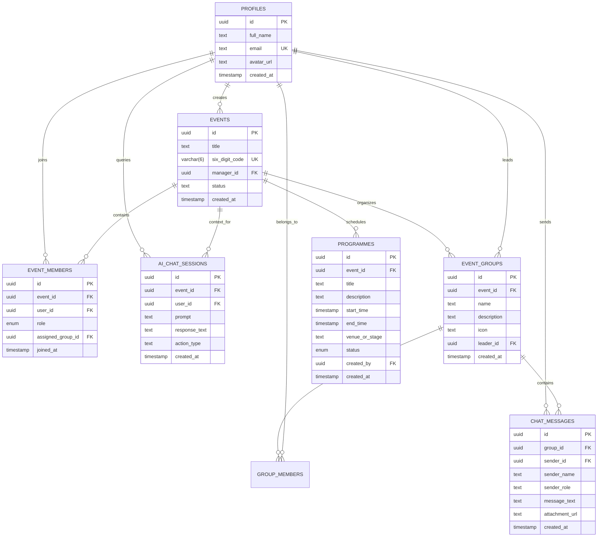

# Data Model & Schema Specification (DATA_MODEL.md)
## Project Name: Sangam (സംഗമം) — Event Command & Coordination Platform
**Team:** LINX (Kraft Night 2026 Hackathon)  
**Status:** Approved for Implementation  
**Author:** Team LINX  

---

## 1. Entity-Relationship (ER) Diagram



---

## 2. Production PostgreSQL Schema (Supabase DDL)

```sql
-- Enable necessary extensions
CREATE EXTENSION IF NOT EXISTS "uuid-ossp";

-- ==============================================================================
-- 1. Profiles Table (Linked with Supabase Auth or Local Session)
-- ==============================================================================
CREATE TABLE IF NOT EXISTS public.profiles (
    id UUID PRIMARY KEY DEFAULT gen_random_uuid(),
    full_name TEXT NOT NULL,
    email TEXT UNIQUE NOT NULL,
    avatar_url TEXT,
    created_at TIMESTAMPTZ DEFAULT NOW() NOT NULL
);

ALTER TABLE public.profiles ENABLE ROW LEVEL SECURITY;
CREATE POLICY "Allow public read access to profiles" ON public.profiles FOR SELECT USING (true);
CREATE POLICY "Allow users to update own profile" ON public.profiles FOR UPDATE USING (auth.uid() = id);

-- ==============================================================================
-- 2. Events Table
-- ==============================================================================
CREATE TABLE IF NOT EXISTS public.events (
    id UUID PRIMARY KEY DEFAULT gen_random_uuid(),
    title TEXT NOT NULL,
    six_digit_code VARCHAR(6) UNIQUE NOT NULL,
    manager_id UUID REFERENCES public.profiles(id) ON DELETE CASCADE,
    status TEXT DEFAULT 'active' CHECK (status IN ('draft', 'active', 'completed', 'archived')),
    created_at TIMESTAMPTZ DEFAULT NOW() NOT NULL
);

CREATE INDEX IF NOT EXISTS idx_events_six_digit_code ON public.events(six_digit_code);
ALTER TABLE public.events ENABLE ROW LEVEL SECURITY;
CREATE POLICY "Allow public read access to events" ON public.events FOR SELECT USING (true);
CREATE POLICY "Allow manager to update event" ON public.events FOR UPDATE USING (auth.uid() = manager_id);

-- ==============================================================================
-- 3. Operational Groups (e.g., Food Coordination, Stage & Sound)
-- ==============================================================================
CREATE TABLE IF NOT EXISTS public.event_groups (
    id UUID PRIMARY KEY DEFAULT gen_random_uuid(),
    event_id UUID REFERENCES public.events(id) ON DELETE CASCADE NOT NULL,
    name TEXT NOT NULL,
    description TEXT,
    icon TEXT DEFAULT '👥',
    leader_id UUID REFERENCES public.profiles(id) ON DELETE SET NULL,
    created_at TIMESTAMPTZ DEFAULT NOW() NOT NULL
);

CREATE INDEX IF NOT EXISTS idx_event_groups_event_id ON public.event_groups(event_id);
ALTER TABLE public.event_groups ENABLE ROW LEVEL SECURITY;
CREATE POLICY "Allow read access to event groups" ON public.event_groups FOR SELECT USING (true);

-- ==============================================================================
-- 4. Event Members & Role Assignments
-- ==============================================================================
DO $$ BEGIN
    CREATE TYPE event_role_type AS ENUM ('overseer', 'manager', 'lead', 'volunteer');
EXCEPTION
    WHEN duplicate_object THEN null;
END $$;

CREATE TABLE IF NOT EXISTS public.event_members (
    id UUID PRIMARY KEY DEFAULT gen_random_uuid(),
    event_id UUID REFERENCES public.events(id) ON DELETE CASCADE NOT NULL,
    user_id UUID REFERENCES public.profiles(id) ON DELETE CASCADE NOT NULL,
    role event_role_type NOT NULL DEFAULT 'volunteer',
    assigned_group_id UUID REFERENCES public.event_groups(id) ON DELETE SET NULL,
    joined_at TIMESTAMPTZ DEFAULT NOW() NOT NULL,
    UNIQUE(event_id, user_id)
);

CREATE INDEX IF NOT EXISTS idx_event_members_event ON public.event_members(event_id);
CREATE INDEX IF NOT EXISTS idx_event_members_user ON public.event_members(user_id);
ALTER TABLE public.event_members ENABLE ROW LEVEL SECURITY;
CREATE POLICY "Allow members read access" ON public.event_members FOR SELECT USING (true);

-- ==============================================================================
-- 5. Programmes Table (Event Schedule Timeline)
-- ==============================================================================
CREATE TABLE IF NOT EXISTS public.programmes (
    id UUID PRIMARY KEY DEFAULT gen_random_uuid(),
    event_id UUID REFERENCES public.events(id) ON DELETE CASCADE NOT NULL,
    title TEXT NOT NULL,
    description TEXT,
    start_time TIMESTAMPTZ NOT NULL,
    end_time TIMESTAMPTZ,
    venue_or_stage TEXT DEFAULT 'Main Stage',
    status TEXT DEFAULT 'scheduled' CHECK (status IN ('scheduled', 'in_progress', 'completed', 'delayed')),
    created_by UUID REFERENCES public.profiles(id),
    created_at TIMESTAMPTZ DEFAULT NOW() NOT NULL
);

CREATE INDEX IF NOT EXISTS idx_programmes_event_time ON public.programmes(event_id, start_time);
ALTER TABLE public.programmes ENABLE ROW LEVEL SECURITY;
CREATE POLICY "Allow read access to programmes" ON public.programmes FOR SELECT USING (true);

-- ==============================================================================
-- 6. In-App Group Chat Messages Table
-- ==============================================================================
CREATE TABLE IF NOT EXISTS public.chat_messages (
    id UUID PRIMARY KEY DEFAULT gen_random_uuid(),
    group_id UUID REFERENCES public.event_groups(id) ON DELETE CASCADE NOT NULL,
    sender_id UUID REFERENCES public.profiles(id) ON DELETE CASCADE NOT NULL,
    sender_name TEXT NOT NULL,
    sender_role TEXT DEFAULT 'volunteer',
    message_text TEXT NOT NULL,
    attachment_url TEXT,
    created_at TIMESTAMPTZ DEFAULT NOW() NOT NULL
);

CREATE INDEX IF NOT EXISTS idx_chat_messages_group ON public.chat_messages(group_id, created_at);
ALTER TABLE public.chat_messages ENABLE ROW LEVEL SECURITY;
CREATE POLICY "Allow read chat messages" ON public.chat_messages FOR SELECT USING (true);
CREATE POLICY "Allow insert chat messages" ON public.chat_messages FOR INSERT WITH CHECK (true);

-- ==============================================================================
-- 7. Gemini AI Chat Logs Table
-- ==============================================================================
CREATE TABLE IF NOT EXISTS public.ai_chat_sessions (
    id UUID PRIMARY KEY DEFAULT gen_random_uuid(),
    event_id UUID REFERENCES public.events(id) ON DELETE CASCADE NOT NULL,
    user_id UUID REFERENCES public.profiles(id) ON DELETE CASCADE NOT NULL,
    prompt TEXT NOT NULL,
    response_text TEXT NOT NULL,
    action_type TEXT DEFAULT 'query',
    created_at TIMESTAMPTZ DEFAULT NOW() NOT NULL
);

-- ==============================================================================
-- 8. Enable Realtime Publications
-- ==============================================================================
ALTER PUBLICATION supabase_realtime ADD TABLE public.chat_messages;
ALTER PUBLICATION supabase_realtime ADD TABLE public.programmes;
ALTER PUBLICATION supabase_realtime ADD TABLE public.event_members;
```

---

## 3. Client-Side Mock Database Schema (`config.js`)

For offline evaluation and instant zero-dependency execution, the application initializes with seed data mirroring the handwritten notes:

```javascript
export const SEED_DATA = {
  event: {
    id: "evt-kraft-2026",
    title: "Kraft Night 2026",
    sixDigitCode: "482910",
    managerName: "Sarah Jenkins"
  },
  groups: [
    {
      id: "grp-food",
      name: "Food Coordination Group",
      icon: "🥗",
      leaderId: "usr-athul",
      leaderName: "Athul K."
    },
    {
      id: "grp-stage",
      name: "Stage & Sound Team",
      icon: "🔊",
      leaderId: "usr-safti",
      leaderName: "Safti M."
    },
    {
      id: "grp-vip",
      name: "VIP Protocol & Hospitality",
      icon: "👑",
      leaderId: "usr-aravind",
      leaderName: "Aravind Menon"
    }
  ],
  joinedPeople: [
    {
      id: "usr-athul",
      name: "Athul K.",
      email: "athul@example.com",
      role: "lead",
      department: "Food Coordination Group",
      status: "active"
    },
    {
      id: "usr-athira",
      name: "Athira S.",
      email: "athira@example.com",
      role: "volunteer",
      department: "Food Coordination Group",
      status: "active"
    },
    {
      id: "usr-imdad",
      name: "Imdad M.",
      email: "imdad@example.com",
      role: "overseer",
      department: "VIP Overseer (Principal)",
      status: "active"
    }
  ],
  programmes: [
    {
      id: "prog-01",
      title: "Inauguration Ceremony",
      description: "Welcome address, lamp lighting, and keynote speech.",
      startTime: "18:00",
      endTime: "19:15",
      stage: "Main Auditorium",
      status: "completed"
    },
    {
      id: "prog-02",
      title: "Cultural Show & Live Bands",
      description: "Student music performances and guest live bands.",
      startTime: "19:30",
      endTime: "21:00",
      stage: "Open Air Amphitheater",
      status: "in_progress"
    },
    {
      id: "prog-03",
      title: "Grand Banquet & Dinner",
      description: "Catering service and dining coordination for all attendees.",
      startTime: "21:00",
      endTime: "22:30",
      stage: "Banquet Hall",
      status: "scheduled"
    },
    {
      id: "prog-04",
      title: "Awards & Valedictory",
      description: "Prize distribution and closing remarks.",
      startTime: "22:30",
      endTime: "23:30",
      stage: "Main Auditorium",
      status: "scheduled"
    }
  ],
  messages: {
    "grp-food": [
      {
        id: "msg-101",
        senderName: "Sarah (Manager)",
        senderRole: "manager",
        text: "Morning team! Status on catering delivery? @Athul",
        time: "10:31"
      },
      {
        id: "msg-102",
        senderName: "Athul (Team Leader)",
        senderRole: "lead",
        text: "On it, Sarah. Just confirmed departure from the venue. ETA 20 mins.",
        time: "10:32"
      },
      {
        id: "msg-103",
        senderName: "Athira (Volunteer)",
        senderRole: "volunteer",
        text: "Buffet tables are sanitized and serving trays are ready at Hall B.",
        time: "10:33"
      }
    ]
  }
};
```
