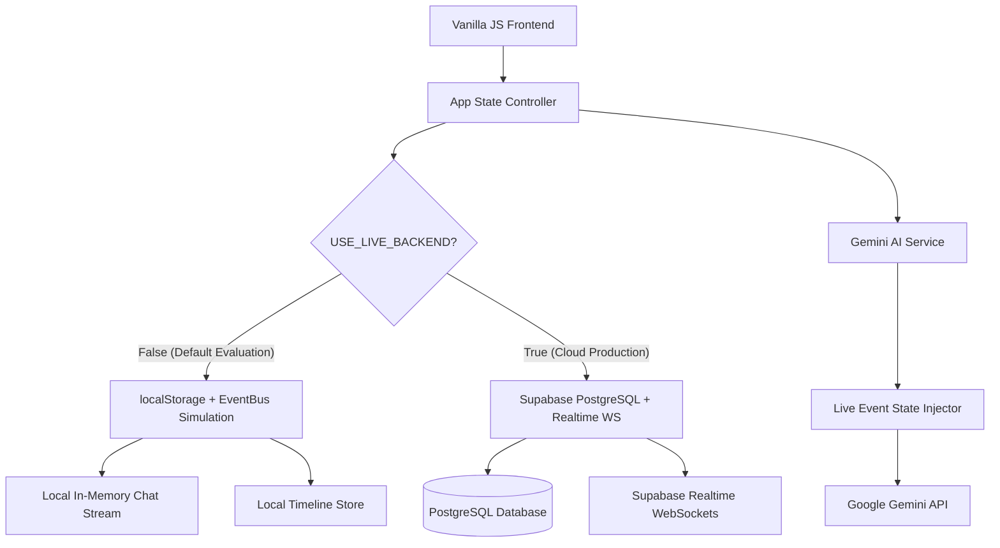

# Technical Requirements Document (TRD)
## Project Name: Sangam (സംഗമം) — Event Command & Coordination Platform
**Team:** LINX (Kraft Night 2026 Hackathon)  
**Status:** Approved for Implementation  
**Author:** Team LINX  

---

## 1. Technical Stack

| Layer | Technology | Rationale |
| :--- | :--- | :--- |
| **Frontend Core** | HTML5 Semantic Elements, Modern CSS3, Vanilla JavaScript (ES6+ Modules) | Zero bundlers, zero framework bloat, sub-100ms cold start, portable across any static server. |
| **Styling System** | Custom CSS3 Custom Properties (Design Tokens), CSS Grid, Flexbox, light workspace system | Pixel-level control, fluid responsive layouts with mobile drawers, accessible focus and reduced-motion support, no Tailwind/Bootstrap. |
| **Backend & Database** | Supabase (PostgreSQL 15, Supabase Realtime WebSockets, Supabase Auth) | Managed relational database, low-latency WebSocket pub/sub for in-app chat, and robust Row-Level Security (RLS). |
| **AI Intelligence** | Google AI JavaScript SDK / Gemini API (`gemini-1.5-flash` / `gemini-2.0-flash`) | Fast inference, 1M+ context window, excellent structured output generation for event briefings and timeline queries. |
| **Email Service** | SendGrid v3 Mail API | Automated transactional email invites for external participants with the 6-digit event code. |

---

## 2. System Architecture & Dual-Mode Execution

To ensure seamless evaluation both offline (during initial judge review) and online (with production cloud services), the platform implements a **Hybrid Dual-Mode Architecture**:



### 2.1. Dual-Mode Specifications
1. **Mock Evaluation Mode (`USE_LIVE_BACKEND = false`)**:
   - Stores events, programs, members, and chat messages in `localStorage`.
   - Simulates multi-user real-time chat via an internal `EventBus` pub/sub and synthetic response triggers.
   - Fallback AI responses operate using a local intelligent heuristic rule-engine when no Gemini API key is configured.
2. **Live Cloud Mode (`USE_LIVE_BACKEND = true`)**:
   - Synchronizes directly with Supabase tables (`events`, `programmes`, `event_members`, `chat_messages`).
   - Uses Supabase Realtime WebSocket channels to broadcast in-app messages and timeline changes instantly across connected browser tabs.
    - Communicates with Google Gemini only through the Supabase Edge Function,
      which reads its secure server-side secret.

---

## 3. Real-Time Communication Specification (In-App Chat)

### 3.1. Supabase Realtime Channel Configuration
- **Channel Pattern**: `realtime:event_group_{groupId}`
- **Event**: `INSERT` on table `public.chat_messages`
- **Filter**: `group_id=eq.{activeGroupId}`

### 3.2. Chat Message Payload Schema
```typescript
interface ChatMessagePayload {
  id: string;              // UUID
  group_id: string;        // UUID of the operational group (e.g. Food, Stage)
  sender_id: string;       // UUID of the profile
  sender_name: string;     // Display name (e.g. "Athul K.")
  sender_role: 'manager' | 'lead' | 'volunteer' | 'overseer';
  message_text: string;    // Plain text message
  attachment_url?: string; // Optional image / media URL
  created_at: string;      // ISO 8601 UTC timestamp
}
```

---

## 4. Role-Based Access Control (RBAC) Enforcement Engine

The application enforces permissions at two levels:
1. **Client-Side Navigation & Action Guard**: UI controls (inputs, buttons, modals) dynamically adapt, disable, or hide based on the active role.
2. **Database Row-Level Security (RLS)**: PostgreSQL policies prevent unauthorized writes.

### Permission Mapping Table

| Operational Action | Manager | Overseer / VIP | Team Leader | Volunteer |
| :--- | :---: | :---: | :---: | :---: |
| `CREATE_PROGRAM` | ✅ Allowed | ❌ Blocked | ❌ Blocked | ❌ Blocked |
| `UPDATE_PROGRAM_STATUS` | ✅ Allowed | ❌ Blocked | ❌ Blocked | ❌ Blocked |
| `ASSIGN_ROLE` | ✅ Allowed | ❌ Blocked | ❌ Blocked | ❌ Blocked |
| `CREATE_GROUP` | ✅ Allowed | ❌ Blocked | ❌ Blocked | ❌ Blocked |
| `POST_CHAT_MESSAGE` (Any group) | ✅ Allowed | ❌ Blocked (Read-only) | ❌ Blocked (Only assigned) | ❌ Blocked (Only assigned) |
| `POST_CHAT_MESSAGE` (Assigned group) | ✅ Allowed | ❌ Blocked (Read-only) | ✅ Allowed | ✅ Allowed |
| `VIEW_ALL_CHAT_CHANNELS` | ✅ Allowed | ✅ Allowed (Read-only) | ✅ Allowed (Read-only) | ❌ Blocked |

---

## 5. Gemini AI Service Specification

### 5.1. Context Injection Pipeline
Before sending a prompt to the Gemini API, the client aggregates the current event state into a compact system context block:
```javascript
const eventContext = {
  eventTitle: currentEvent.title,
  eventCode: currentEvent.sixDigitCode,
  activeProgram: getActiveProgram(programmes),
  upcomingPrograms: getUpcomingPrograms(programmes),
  delayedPrograms: getDelayedPrograms(programmes),
  departments: groups.map(g => ({ name: g.name, leader: g.leaderName, memberCount: g.members.length })),
  joinedPeople: members.map(m => ({ name: m.name, role: m.role, department: m.departmentName }))
};
```

### 5.2. System Prompt Template
```
You are the Sangam AI Event Coordinator for '{eventTitle}' (Event Code: {eventCode}).
Your role is to assist managers, leaders, and volunteers by providing instant situational briefings, schedule clash warnings, and clear operational recommendations.
Current Event Context:
- Active Program: {activeProgram}
- Upcoming Timeline: {upcomingPrograms}
- Delayed Items: {delayedPrograms}
- Operational Groups: {departments}

Rules:
1. Provide concise, professional answers tailored to event coordinators.
2. If asked to draft an announcement, format it clearly with emojis and key timestamps.
3. If an operational clash is detected, flag it with a ⚠️ warning immediately.
```

---

## 6. Directory Structure & Module Architecture

```
submissions/team-linx/
├── README.md                  # Hackathon team submission overview
├── SETUP.md                   # Step-by-step credentials and setup guide
├── docs/                      # Complete specifications & visual wireframes
│   ├── images/                # High-fidelity UI mockups (01 to 04)
│   ├── PRD.md                 # Product Requirements Document
│   ├── TRD.md                 # Technical Requirements Document
│   ├── ARCHITECTURE.md        # System Architecture & Flow Diagrams
│   ├── COMPONENTS.md          # UI Component Specifications
│   └── DATA_MODEL.md          # Database Schemas & DDL
└── app/                       # The Live Web Application
    ├── index.html             # Multi-view application shell
    ├── style.css              # Glassmorphic design tokens and styles
    ├── env.example.js         # Template for Supabase & Gemini keys
    ├── js/
    │   ├── main.js            # App orchestrator, view router & event handlers
    │   ├── config.js          # App configuration, state presets & mock database
    │   ├── auth.js            # User authentication & role-switching state
    │   ├── tasks.js           # Program scheduling & task management
    │   ├── chat.js            # In-app team group chat & RBAC enforcement
    │   ├── ai.js              # Gemini AI assistant client & context builder
    │   ├── email.js           # SendGrid invitation integration
    │   └── supabase-client.js # Supabase client initialization & fallback logic
    └── supabase/
        └── schema.sql         # PostgreSQL tables, RLS policies & Realtime pub/sub
```
